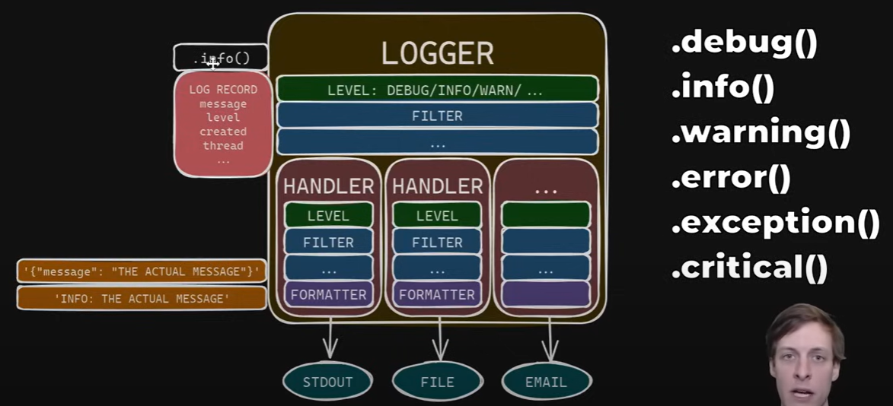
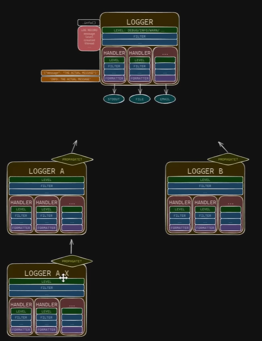
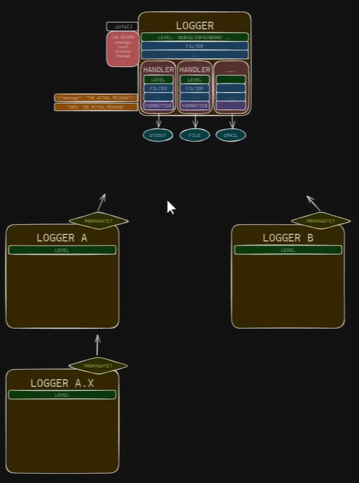

# uv_project_setup
faster than pip & venv combined → [uv](https://docs.astral.sh/uv/#highlights)

1. ```pip install uv```
2. ```uv init '{project_name}'``` OR ```uv init``` (for current dir)
3. ```uv venv```
4. ```.venv/Scripts/activate```
5. ```uv add numpy```
6. ```uv add -r requirements.txt```
7. ```uv run main.py```
8. ```uv sync``` → to sync all the pkgs.
9. ```uv lock``` → to lock all the pkgs.
10. ```uv tree``` (dependencies)
11. testing py tools: ```uv tool run ruff check``` OR ```uvx ruff check```
12. ```uv tool install ruff```


mac/linux: ```pip freeze > requirements.txt```


brain fck (but necessary): [Hynek Schlawack](https://www.youtube.com/watch?v=mFyE9xgeKcA)


## RUFF
1. find linting issues: ```ruff check main.py``` OR ```ruff check .```
2. fix those linting issues: ```ruff check --fix```
3. kinda like git diff: ```ruff check --fix --diff```
4. whitespaces & all: ```ruff format```
5. check for errors in real-time: ```ruff check --watch```


## LOGGER


### Logging Tree

→ unnecessarily complex for most use-cases

### Better way: put all logger handlers/filters on the root logger

→ however, don't use the root logger in code